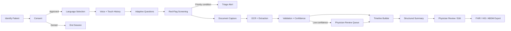
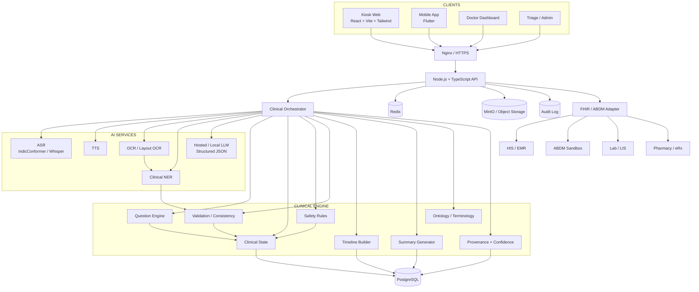
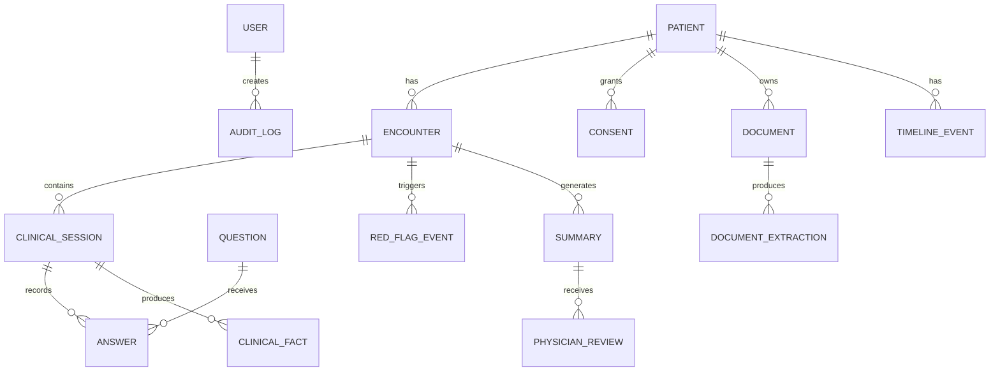
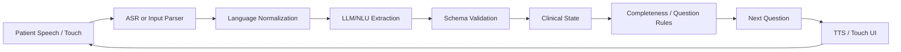
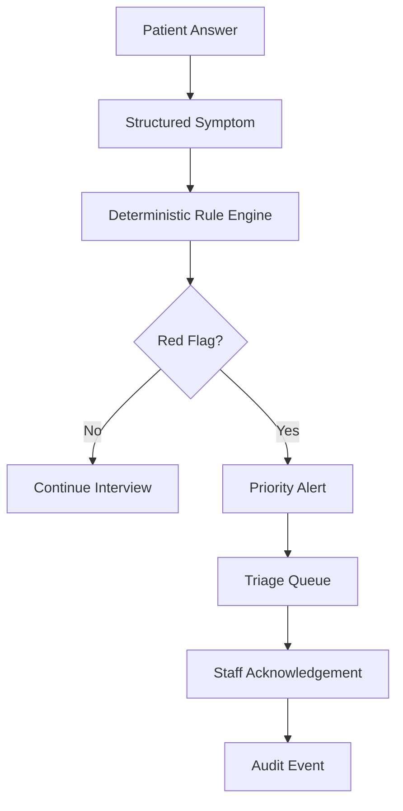
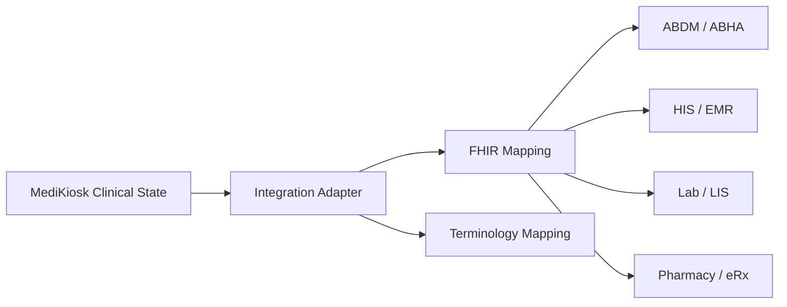

# MediKiosk — Complete Project Context & Technical Specification

## 0. Document Purpose

This document is the **master engineering context** for implementing the SIH 2026 project against Problem Statement **SIH26047 — Patient Case-Taking Software**.

It is written to be consumed by developers, architects, AI coding assistants (including Antigravity), reviewers, and new team members.

### Authority hierarchy

1. **Original SIH PS** = source of truth for what the solution must solve.
2. **Final team PPT** = approved high-level architecture, features, technology choices, risks, and intended demo scope.
3. **This document** = engineering interpretation and implementation contract derived from the above.
4. Implementation details may evolve, but must not silently contradict the PS or the safety boundaries defined here.

---

# 1. Problem Statement

## 1.1 Official problem

- **Problem Statement ID:** SIH26047
- **Title:** Patient Case-Taking Software
- **Theme:** Smart Automation
- **Category:** Software
- **Organization:** Ministry of Ayush
- **Department:** All India Institute of Ayurveda
- **Team:** LexCorps

The PS identifies a clinical history-taking bottleneck in crowded Indian OPDs, fragmentation of paper medical records, multilingual/accessibility challenges, the additional depth required in AYUSH history taking, and the lack of a patient-facing first-mile mechanism connecting these inputs to hospital digital-health workflows.

## 1.2 Core problem in engineering terms

Doctors should receive a **structured, reviewable, pre-consultation patient information package** instead of spending a large portion of the encounter manually collecting history and deciphering scattered prior documents.

The software must support:

- patient self-service intake
- voice + touch interaction
- multilingual use
- adaptive clinical history questioning
- document capture and medical OCR
- clinical entity extraction
- chronology/timeline construction
- AYUSH-specific assessment fields
- red-flag screening and triage escalation
- structured physician-ready summary
- source/provenance and confidence visibility
- physician verification/editing
- consent and access control
- FHIR/ABDM/HIS integration architecture

## 1.3 What MediKiosk is

**MediKiosk is a pre-consultation clinical intake and information-structuring platform.**

It converts:

```text
Patient speech + touch responses + paper documents
                    ↓
        AI-assisted interpretation
                    ↓
       Structured clinical state
                    ↓
 Validation + safety + provenance controls
                    ↓
     Physician-reviewable briefing
                    ↓
         HIS / FHIR / ABDM
```

## 1.4 What MediKiosk is NOT

MediKiosk is not:

- an autonomous doctor
- an autonomous diagnostician
- an autonomous prescribing system
- a treatment recommendation engine
- a replacement for a physician
- a guaranteed handwriting OCR system
- a guaranteed emergency detector
- a replacement for HIS/EMR
- a replacement for ABDM

The physician remains the final authority.

---

# 2. Product Vision

## 2.1 Product statement

> **MediKiosk converts fragmented patient speech and physical medical records into structured, provenance-aware clinical information before the physician encounter.**

## 2.2 Product goals

1. Reduce repetitive history-taking work.
2. Improve completeness of the information available before consultation.
3. Convert physical records into usable structured information.
4. Make the workflow accessible to elderly and low-literacy users.
5. Support both modern clinical and AYUSH case-taking.
6. Surface safety-sensitive information to staff without autonomous diagnosis.
7. Make every AI-derived fact reviewable through source and confidence metadata.
8. Prepare information for FHIR/HIS/ABDM interoperability.

## 2.3 Non-goals for SIH MVP

Do not expand scope into:

- hospital ERP
- billing
- insurance claims
- pharmacy management
- autonomous clinical decision-making
- nationwide production ABDM deployment
- all Indian languages in the first build
- large autonomous multi-agent architecture
- custom foundation-model training
- blockchain without a real product requirement

---

# 3. Core User Roles

| Role | Primary responsibility | Main interface |
|---|---|---|
| Patient | Provide history, consent, documents | Kiosk / optional mobile app |
| Physician | Review, edit, verify clinical briefing | Doctor dashboard |
| Nurse/Triage | Receive and acknowledge priority alerts | Triage dashboard |
| AYUSH Practitioner | Review AYUSH-specific case information | Doctor/AYUSH view |
| Hospital Admin | Monitor operations and throughput | Admin dashboard |
| IT Admin | Security, configuration, integration | Admin/settings |

### Access principle

Use **least privilege**. Clinical data must be available only to users who require it for the current workflow.

---

# 4. End-to-End Product Flow



### Working demo journey

1. Identify through ABHA/hospital/demo patient identity.
2. Explain and record consent.
3. Choose language.
4. Collect chief complaint.
5. Conduct adaptive history using voice or touch.
6. Run deterministic safety checks continuously.
7. Capture/upload prescriptions and reports.
8. OCR and extract clinical entities.
9. Assign confidence and provenance.
10. Route uncertain information to review.
11. Build a longitudinal timeline.
12. Generate controlled physician summary.
13. Physician edits/verifies.
14. Export structured data through the integration layer.

---

# 5. Architectural Principles

## 5.1 Core principle

> **LLM is a component inside the system, not the system itself.**

## 5.2 Safety hierarchy

```text
DATA
 ↓
AI INTERPRETATION
 ↓
STRUCTURED CLINICAL REPRESENTATION
 ↓
VALIDATION + SAFETY RULES
 ↓
PHYSICIAN VERIFICATION
```

## 5.3 Responsibility split

### AI can help with

- speech recognition
- natural-language understanding
- language normalization
- clinical entity extraction
- OCR post-processing
- controlled summarization
- translation
- conversational phrasing

### Deterministic services must own

- authentication
- authorization
- consent state transitions
- question eligibility / workflow transitions
- red-flag rules
- required-field completeness
- data validation
- contradiction checks
- provenance assignment
- confidence thresholds
- timeline ordering
- FHIR mappings
- persistence
- audit logging

## 5.4 Database is the source of truth

Raw model output must never be treated as authoritative clinical truth.

Correct pattern:

```text
LLM proposes
   ↓
Schema validator
   ↓
Domain validation
   ↓
Provenance + confidence
   ↓
Structured clinical state
   ↓
Physician verification
```

Incorrect pattern:

```text
LLM response
   ↓
Direct DB write
   ↓
Presented as medical truth
```

---

# 6. High-Level System Architecture



---

# 7. Frontend Architecture

## 7.1 React kiosk

Primary SIH interface.

Recommended structure:

```text
apps/kiosk-web/
  src/
    app/
    routes/
    components/
    features/
      onboarding/
      consent/
      language/
      interview/
      voice/
      documents/
      review/
      completion/
    services/
    hooks/
    types/
    utils/
```

### Patient screens

1. Welcome
2. Identify patient
3. Language selection
4. Consent
5. Chief complaint
6. Adaptive interview
7. Voice/touch answer screen
8. Red-flag intervention state
9. Document capture/upload
10. Document review
11. Extracted information review
12. Timeline preview
13. Confirmation
14. Completion

### UX rules

- Every spoken question must also be answerable by touch.
- Never require keyboard typing for the primary flow.
- Large touch targets.
- Minimal text density.
- Audio prompts for key consent and navigation steps.
- Clear progress indicator.
- Persistent "repeat question" affordance.
- Language must remain visible.
- Never hide safety alerts behind normal queue UI.

## 7.2 Doctor dashboard

Core panels:

- patient identity
- chief complaint
- HPI
- past medical/surgical history
- medication list
- allergy list
- investigations
- timeline
- scanned documents
- red flags
- missing information
- provenance/confidence
- editable summary
- verification controls
- export controls

## 7.3 Flutter app

Flutter is a **secondary client**, not a duplicate kiosk implementation.

Primary use cases:

- optional patient pre-registration
- document upload before visit
- pre-consultation history completion
- patient-side record review where appropriate
- tablet/mobile deployment extensions

Both React and Flutter consume the same backend contracts.

---

# 8. Backend Architecture

## 8.1 Backend modules

```text
backend/src/
  modules/
    auth/
    users/
    patients/
    encounters/
    consent/
    interview/
    questions/
    documents/
    extraction/
    safety/
    timeline/
    summaries/
    verification/
    notifications/
    fhir/
    audit/

  ai/
    asr/
    tts/
    ocr/
    llm/
    ner/

  rules/
    red-flags/
    validation/
    completeness/
    contradiction/

  database/
  storage/
  middleware/
  config/
  jobs/
  shared/
```

## 8.2 API principles

- REST for resource operations.
- WebSocket/SSE only where real-time updates are valuable.
- API versioning: `/api/v1/...`
- All requests authenticated except intentionally public health/configuration endpoints.
- Use request/response schemas.
- Never expose database models directly.
- Never allow arbitrary client-selected patient access.
- Authorization must be checked server-side.

---

# 9. Clinical Data Model

## 9.1 Core entities

```text
User
Role
Patient
Encounter
Consent
ClinicalSession
Question
Answer
ClinicalFact
Symptom
Medication
Allergy
DiagnosisHistory
Investigation
LabResult
Document
DocumentExtraction
TimelineEvent
RedFlagEvent
Summary
PhysicianReview
FHIRExport
AuditLog
```

## 9.2 Recommended relationship



## 9.3 Clinical fact model

Every fact should support at minimum:

```json
{
  "id": "fact_123",
  "patientId": "patient_123",
  "encounterId": "enc_123",
  "field": "medication.name",
  "value": "Amlodipine",
  "sourceType": "DOCUMENT",
  "sourceId": "doc_456",
  "confidence": 0.91,
  "verificationStatus": "PENDING",
  "capturedAt": "2026-08-30T10:00:00Z"
}
```

Allowed source types should include values such as:

- PATIENT_REPORTED
- DOCUMENT
- AI_EXTRACTED
- SYSTEM_DERIVED (only when derived deterministically)
- PHYSICIAN_VERIFIED

Do not convert `AI_EXTRACTED` into `PHYSICIAN_VERIFIED` unless a clinician actually verifies/edits/accepts it.

---

# 10. Clinical JSON Contract

Use structured schemas throughout the AI pipeline.

Example:

```json
{
  "chiefComplaint": {
    "text": "Chest pain",
    "source": "PATIENT_REPORTED"
  },
  "hpi": {
    "onset": "yesterday",
    "character": "burning",
    "severity": 6,
    "radiation": "none",
    "aggravatingFactors": ["after eating"]
  },
  "medications": [],
  "allergies": [],
  "redFlags": [],
  "missingFields": ["relievingFactors"]
}
```

### Schema rules

- Fixed allowed fields.
- Explicit nullable fields where required.
- No free-form extra clinical fields in production responses.
- Reject malformed output.
- Never infer missing information merely to satisfy schema requirements.
- Uncertain information stays uncertain.

---

# 11. Conversational Engine

## 11.1 Architecture



## 11.2 Question engine

Question selection must be primarily driven by:

- current encounter
- current complaint
- clinical state
- question bank
- completion status
- permitted branching rules
- safety rules

The LLM may interpret natural language but should not invent arbitrary clinical interview structure.

## 11.3 Adaptive questioning example

Patient says:

> "Kal raat se chest mein burning hai aur khana khane ke baad badh jaati hai."

System can populate:

```text
Complaint = chest discomfort
Character = burning
Onset = last night
Aggravating factor = after eating
```

Then skip questions that are already answered and ask for missing fields.

---

# 12. AI Service Design

## 12.1 ASR

Suggested starting options:

- IndicConformer
- Whisper-family model

Initial production/demo language scope:

- Hindi
- English
- Hinglish

Do not claim 22-language production support until independently tested.

### ASR quality metrics

- Word Error Rate (WER)
- language accuracy
- code-switching accuracy
- clinical-term recognition
- latency

## 12.2 TTS

Start with a reliable local or API-based Indian-language TTS path. Browser/native TTS can be used temporarily for prototyping only where language quality is acceptable.

## 12.3 OCR

Pipeline:

```text
Image/PDF
 ↓
Preprocessing
 ↓
OCR
 ↓
Layout/Table parsing
 ↓
Document classification
 ↓
Clinical entity extraction
 ↓
Normalization
 ↓
Validation
 ↓
Clinical facts
```

Target document classes:

- prescription
- laboratory report
- discharge summary
- procedure/report document
- referral/other clinical document

OCR output is not itself a clinical record.

## 12.4 NER / Clinical extraction

Extract entities such as:

- diagnosis/condition
- medication
- dose
- frequency
- allergy
- investigation/test
- result/value
- unit
- reference range
- procedure
- date
- physician/facility when relevant

## 12.5 LLM

Use the LLM for narrow, structured tasks:

- language understanding
- normalization
- entity extraction
- document extraction support
- controlled summary generation

Preferred pattern:

```text
Structured input
    ↓
Strict system prompt
    ↓
JSON schema
    ↓
LLM
    ↓
Schema validator
    ↓
Domain validator
```

### Do not use the LLM for

- authentication
- RBAC
- consent authorization
- database writes without validation
- final red-flag decision
- FHIR mapping logic
- timeline sorting
- access permissions

---

# 13. Document Intelligence

## 13.1 Document states

```text
UPLOADED
 ↓
VALIDATED
 ↓
PROCESSING
 ↓
OCR_COMPLETE
 ↓
EXTRACTION_COMPLETE
 ↓
VALIDATED
 ↓
LINKED_TO_TIMELINE
```

Failure path:

```text
PROCESSING
 ↓
LOW_CONFIDENCE / ERROR
 ↓
PHYSICIAN_REVIEW
```

## 13.2 Confidence-aware extraction

Example UI:

```text
Medication: Amlodipine 5 mg
Confidence: 0.96
Source: Prescription / Page 1
Status: AI Extracted

Medication: ______ 20 mg
Confidence: 0.41
Status: Verification Required
```

Never silently fill uncertain handwriting.

---

# 14. Timeline Engine

Timeline events should be constructed from evidence, not fabricated.

```json
{
  "eventType": "MEDICATION",
  "eventDate": "2025-05-12",
  "description": "Amlodipine started",
  "sourceDocumentId": "doc_001",
  "confidence": 0.94
}
```

If date is unknown:

```text
Date: Unknown
Source: Uploaded document
```

If dates conflict:

```text
CONFLICT DETECTED
Document A: 12/05/2025
Document B: 15/05/2025
Physician verification required
```

The timeline engine must not invent missing dates.

---

# 15. Safety & Red-Flag Engine

## 15.1 Philosophy

The system is allowed to **screen and escalate**, not diagnose.

Correct:

> Potential emergency symptoms detected. Please alert clinical staff.

Incorrect:

> You are having a heart attack.

## 15.2 Architecture



## 15.3 Rule definition model

Rules should be stored as configuration/code with explicit versioning.

Example conceptual format:

```json
{
  "ruleId": "RF_CHEST_001",
  "version": "1.0",
  "enabled": true,
  "conditions": [
    "chest_pain == true",
    "severe_breathlessness == true"
  ],
  "action": "TRIAGE_PRIORITY",
  "message": "Potential emergency symptoms detected. Alert clinical staff."
}
```

Clinical safety rules must be reviewed by an appropriate domain expert before being treated as clinical policy. Do not invent medically significant rules casually.

---

# 16. Validation, Completeness & Contradictions

## 16.1 Completeness

Track required and optional fields for each encounter type.

Example:

```text
History completeness
██████████████░░ 88%
```

## 16.2 Contradiction detection

Example:

```text
⚠ INFORMATION CONFLICT

Patient reported:
No history of diabetes

Document states:
Type 2 diabetes documented

Action:
Physician verification required
```

The system should surface the conflict, not decide which source is true.

## 16.3 Validation categories

- schema validation
- type validation
- value-range validation
- temporal validation
- required-field validation
- source/provenance validation
- contradiction detection
- domain-specific sanity checks

---

# 17. Provenance & Evidence Model

Every fact must answer:

**What? Where from? How confident? Has it been verified?**

Example:

```text
Fact: Hypertension
Source: Discharge Summary
Page: 2
Extraction confidence: 0.93
Verification: Pending
```

For conversational input:

```text
Fact: Dizziness
Source: Patient conversation
Confidence: 0.96
Status: Patient Reported
```

This provenance architecture is a key differentiator and safety mechanism.

---

# 18. Summary Generator

## 18.1 Controlled generation

Never prompt:

> Summarize the patient.

Instead provide structured fields and a fixed schema.

```text
Verified / structured clinical state
          ↓
     Summary template
          ↓
           LLM
          ↓
   JSON schema validation
          ↓
  contradiction/source checks
          ↓
   physician review/edit
```

## 18.2 Summary sections

- Patient
- Chief complaint
- HPI
- Past medical history
- Past surgical history
- Medications
- Allergies
- Family history
- Personal history
- Review of systems
- Investigations
- Document-derived information
- Timeline
- Red flags
- Missing information
- Confidence/verification notes
- AYUSH section where applicable

## 18.3 Bilingual output

Patient-facing confirmation can use local language.
Physician-facing summary can use English and/or configured hospital language.

---

# 19. AYUSH Architecture

AYUSH should be a configurable extension of the clinical history engine, not a separate disconnected application.

```text
                 HISTORY ENGINE
                       │
              ┌────────┴────────┐
              ↓                 ↓
       MODERN CLINICAL       AYUSH MODE
                               │
                               ├── Trividha
                               ├── Ashtavidha
                               ├── Dashavidha
                               ├── Prakriti
                               ├── Vikriti
                               ├── Agni
                               ├── Koshtha
                               ├── Ahara-Vihara
                               ├── Nidana
                               └── Samprapti
```

### Important safety rule

Do not invent Ayurvedic diagnostic/classification rules. The SIH implementation can capture, structure, display and route AYUSH information without pretending to make autonomous Ayurvedic clinical judgments.

---

# 20. Interoperability

## 20.1 Adapter architecture



## 20.2 Design rule

Business logic must not be tightly coupled to a specific hospital integration.

Support adapters:

- FHIR adapter
- REST/mock adapter
- future HL7 adapter

## 20.3 SIH honesty rule

Where production APIs or credentials are unavailable:

- use ABDM sandbox where accessible
- use mock adapters where required
- clearly label mocked integrations
- never claim production integration if it was not actually performed

## 20.4 Expected FHIR resource family

Potential mappings include:

- Patient
- Encounter
- Condition
- Observation
- AllergyIntolerance
- MedicationRequest / appropriate medication resource
- DiagnosticReport
- DocumentReference
- Composition
- Consent
- Procedure
- Provenance

The exact profiles must follow the current applicable ABDM FHIR implementation material during implementation.

---

# 21. Persistence Architecture

## 21.1 PostgreSQL

Source of truth for structured clinical data:

- patient
- encounter
- consent
- clinical facts
- questions/answers
- medications
- allergies
- investigations
- timeline events
- alerts
- summaries
- verification state
- audit metadata

## 21.2 Redis

Ephemeral state only:

- active session
- current question
- conversation state
- short-lived cache
- locks / temporary state

Do not make Redis the permanent clinical source of truth.

## 21.3 MinIO

Object storage for:

- uploaded scans
- PDFs
- images
- audio where required
- processed document artifacts

Store references/metadata in PostgreSQL.

---

# 22. Security Architecture

```text
Client
 ↓ HTTPS / TLS
Nginx
 ↓
API
 ↓
JWT authentication
 ↓
RBAC authorization
 ↓
Business logic
 ↓
PostgreSQL / Redis / MinIO
```

## 22.1 Security controls

- TLS in transit
- AES-256-class encryption at rest where supported
- JWT-based authentication
- RBAC
- least-privilege access
- secure secret management
- input validation
- upload file validation
- malware scanning where feasible
- PHI-safe logs
- session expiry
- audit logging
- retention and cleanup policy
- backup/recovery policy

## 22.2 Untrusted documents

Treat OCR text and uploaded documents as **data, not instructions**.

A malicious document must not be allowed to change system instructions or authorization behavior.

## 22.3 Authorization

Do not rely on frontend restrictions.

Backend authorization should verify:

```text
Authenticated user
+ role
+ patient access
+ encounter relationship
+ permitted operation
```

---

# 23. Audit Logging

Minimum audit fields:

```json
{
  "actorId": "doctor_123",
  "actorRole": "PHYSICIAN",
  "action": "EDIT_SUMMARY",
  "patientId": "patient_456",
  "encounterId": "enc_789",
  "timestamp": "2026-08-30T10:42:17Z",
  "target": "medication",
  "oldValue": "...",
  "newValue": "..."
}
```

Important auditable events:

- login
- patient access
- consent creation/revocation
- document upload/view
- AI extraction
- confidence override
- red-flag creation
- alert acknowledgement
- summary edit
- physician verification
- FHIR export
- role/config changes

---

# 24. Offline / Degraded Operation

Do not attempt fully offline AI for the SIH MVP.

## Online

All intended functions available.

## Degraded connectivity

Support:

- local UI state
- touch interaction
- cached question bank
- temporary local draft
- session recovery
- queued upload/sync

## Reconnection

```text
Local draft
   ↓
Sync queue
   ↓
Server reconciliation
   ↓
Audit event
```

Never lose a patient session because a network request failed at the wrong moment.

---

# 25. Observability

Track:

- API latency
- ASR latency
- OCR processing time
- LLM latency
- failed requests
- queue depth
- active sessions
- document-processing failures
- low-confidence extraction count
- red-flag alerts
- alert acknowledgement time
- session recovery events
- service health

Logs must avoid unnecessary sensitive patient data.

---

# 26. Recommended Repository

```text
medikiosk/
├── apps/
│   ├── kiosk-web/
│   ├── doctor-dashboard/
│   └── mobile/
│
├── backend/
│   ├── src/
│   │   ├── modules/
│   │   ├── ai/
│   │   ├── rules/
│   │   ├── database/
│   │   ├── storage/
│   │   ├── jobs/
│   │   ├── middleware/
│   │   └── config/
│   └── tests/
│
├── packages/
│   ├── clinical-schema/
│   ├── shared-types/
│   └── fhir-mapper/
│
├── infrastructure/
│   ├── docker/
│   ├── nginx/
│   └── postgres/
│
├── docs/
├── scripts/
├── docker-compose.yml
├── .env.example
└── README.md
```

A modular monolith is preferred for SIH. Use clear internal modules rather than prematurely creating microservices.

---

# 27. Environment Configuration

Example `.env.example`:

```env
NODE_ENV=development
PORT=4000

DATABASE_URL=postgresql://...
REDIS_URL=redis://...
MINIO_ENDPOINT=http://localhost:9000
MINIO_ACCESS_KEY=...
MINIO_SECRET_KEY=...
MINIO_BUCKET=medikiosk

JWT_SECRET=...
JWT_EXPIRES_IN=15m

ASR_PROVIDER=indicconformer
ASR_URL=...

OCR_PROVIDER=tesseract
OCR_URL=...

LLM_PROVIDER=...
LLM_API_KEY=...
LLM_MODEL=...

TTS_PROVIDER=...
TTS_URL=...

FHIR_MODE=mock
FHIR_BASE_URL=...
ABDM_BASE_URL=...

AUDIT_LOG_PATH=...
```

Never commit secrets.

---

# 28. Docker Development Stack

Initial local stack:

```text
nginx
frontend
backend
postgres
redis
minio
```

AI services can initially be hosted API endpoints or separate local processes.

Only add GPU-specific containers when the AI benchmark or deployment target actually requires them.

---

# 29. Testing Strategy

## 29.1 Unit tests

Test:

- validation rules
- question branching
- consent transitions
- RBAC
- red-flag rules
- contradiction detection
- timeline ordering
- FHIR mapping
- summary schema validation

## 29.2 Integration tests

Test end-to-end API chains:

```text
Patient → Session → Answer → Clinical State
Document → OCR → Extraction → Fact
Fact → Timeline → Summary
Red Flag → Alert → Acknowledgement → Audit
Summary → Verification → FHIR export
```

## 29.3 AI evaluation

### ASR

- WER
- language accuracy
- code-switching accuracy
- medical-term recognition

### OCR

- character accuracy
- field extraction accuracy
- medication accuracy
- laboratory-value accuracy

### Clinical extraction

- precision
- recall
- F1
- field-level accuracy

### Safety

- sensitivity
- false positives
- false negatives

### Summary

- factuality
- omission rate
- contradiction rate
- physician acceptance/edit rate

Do not invent performance figures before testing.

---

# 30. Synthetic Demo Dataset

Use synthetic patients only in the public SIH demo.

Recommended cases:

### Case A — Normal OPD
Simple complaint, no red flag.

### Case B — AYUSH
Includes Dashavidha/Ahara-Vihara fields.

### Case C — Handwritten prescription
Low-to-medium OCR confidence.

### Case D — Abnormal laboratory result
Demonstrates value extraction and highlighting.

### Case E — Red flag
Triggers deterministic triage workflow.

### Case F — Contradictory / low-confidence data
Demonstrates provenance, conflict detection and physician verification.

---

# 31. Differentiation / Innovation Layer

The base PS features alone are not sufficient as a strong engineering story. The implementation should make the following deeper capabilities visible.

## 31.1 Clinical completeness engine

```text
Patient answer
 ↓
Clinical state
 ↓
Known / missing / uncertain fields
 ↓
Targeted follow-up
```

## 31.2 Provenance-aware clinical record

Every fact visibly carries:

- source
- confidence
- verification state

## 31.3 Contradiction detection

Surface conflicts between patient responses and historical documents without automatically resolving them.

## 31.4 Confidence-aware workflow

High-confidence facts proceed normally.
Low-confidence facts are routed for verification.

## 31.5 Evidence-backed physician summary

Summary should cite or link the underlying source where practical.

## 31.6 Clinical readiness view

Doctor can see:

```text
History completeness: 91%
Documents processed: 4
Low-confidence facts: 2
Conflicts: 1
Red flags: 0
Unanswered critical fields: 1
```

This is an engineering metric, not a claim of clinical quality unless measured and validated.

---

# 32. RAG Policy

RAG is optional and narrow.

Potential valid uses:

- approved hospital protocols
- internal SOPs
- validated terminology references
- approved AYUSH reference material
- FHIR/profile documentation

Do not use RAG as:

- the patient database
- the red-flag engine
- the question state machine
- the authorization layer
- a universal anti-hallucination mechanism

The anti-hallucination architecture is:

```text
Structured input
+ Restricted output schema
+ Provenance
+ Confidence
+ Validation
+ Contradiction detection
+ Deterministic safety rules
+ Physician verification
```

---

# 33. Technology Stack — Final Working Definition

| Layer | Choice | Notes |
|---|---|---|
| Kiosk frontend | React + Vite + Tailwind + TypeScript | Primary SIH UI |
| Mobile | Flutter | Secondary client; same APIs |
| Backend | Node.js + TypeScript | Modular monolith |
| Auth | JWT + RBAC | Server-side authorization |
| ASR | IndicConformer / Whisper | Benchmark before claiming quality |
| TTS | Indic TTS / tested provider | Local language prompts |
| OCR | Tesseract + preprocessing / capable OCR provider | Printed + handwritten target |
| NER | Clinical NER / structured extraction | Medical entity extraction |
| LLM | Structured JSON output | Narrow tasks only |
| DB | PostgreSQL | Clinical source of truth |
| Session | Redis | Ephemeral state |
| Object storage | MinIO | Scans/PDFs/audio |
| Integration | FHIR adapter | ABDM/HIS abstraction |
| Infra | Docker Compose | SIH-first |
| Reverse proxy | Nginx | HTTPS/routing |
| Security | TLS + AES + JWT + RBAC + audit | PHI-oriented controls |

---

# 34. Suggested API Surface

## Authentication

```text
POST /api/v1/auth/login
POST /api/v1/auth/refresh
POST /api/v1/auth/logout
```

## Patients

```text
POST /api/v1/patients
GET  /api/v1/patients/:id
GET  /api/v1/patients/:id/timeline
```

## Consent

```text
POST /api/v1/consents
GET  /api/v1/consents/:id
POST /api/v1/consents/:id/revoke
```

## Sessions

```text
POST /api/v1/sessions
GET  /api/v1/sessions/:id
POST /api/v1/sessions/:id/answers
POST /api/v1/sessions/:id/complete
```

## Questions

```text
GET /api/v1/questions/next?sessionId=...
```

## Voice

```text
POST /api/v1/ai/asr
POST /api/v1/ai/tts
```

## Documents

```text
POST /api/v1/documents
GET  /api/v1/documents/:id
POST /api/v1/documents/:id/process
GET  /api/v1/documents/:id/extraction
```

## Alerts

```text
GET  /api/v1/alerts
POST /api/v1/alerts/:id/acknowledge
```

## Summary

```text
POST /api/v1/summaries/generate
GET  /api/v1/summaries/:id
PATCH /api/v1/summaries/:id
POST /api/v1/summaries/:id/verify
```

## FHIR

```text
POST /api/v1/fhir/export/:encounterId
GET  /api/v1/fhir/export/:id
```

---

# 35. Engineering Conventions

## TypeScript

- strict mode
- no implicit `any`
- Zod or equivalent boundary validation
- shared DTOs/types
- service/controller separation
- repository/data-access abstraction

## React

- feature-based structure
- typed API clients
- predictable state management
- reusable accessibility-first components

## Flutter

- feature-first structure
- typed DTOs
- same backend contract
- no duplicated business logic that belongs on the server

## Database

- migrations only
- no manual production schema edits
- foreign keys
- indexes for common lookups
- explicit transaction boundaries

## Git

Recommended branches:

```text
main
 ├── develop
 ├── feature/patient-kiosk
 ├── feature/clinical-engine
 ├── feature/document-ai
 ├── feature/safety-engine
 ├── feature/doctor-dashboard
 └── feature/fhir-adapter
```

Every feature should have tests before merge.

---

# 36. Definition of Done

A feature is complete only when:

- UI is implemented
- backend endpoint/service exists where required
- validation exists
- authorization is enforced
- errors are handled
- audit implications are addressed
- tests exist
- logging is safe
- documentation is updated
- feature works with synthetic demo data

An AI feature is additionally complete only when:

- input/output schema is fixed
- confidence behavior is defined
- failure path is defined
- human-review path exists where needed
- metrics can be measured

---

# 37. Judge-Facing Technical Story

The core technical story should be:

> **We do not use an LLM as a doctor. We use AI for perception and language understanding, then constrain the result through a deterministic clinical state machine, validation, provenance, safety rules and physician verification.**

Core architecture statement:

```text
Foundation Models
ASR / OCR / LLM
        ↓
MediKiosk Clinical Orchestration
        ↓
Clinical State + Rules + Validation + Provenance
        ↓
Safety Gate
        ↓
Physician Verification
        ↓
FHIR / HIS / ABDM
```

This should remain consistent across the PPT, demo, report, code comments and judge answers.

---

# 38. Final Implementation Objective

The SIH MVP is successful when a team member can demonstrate the following without manually stitching together separate demos:

```text
Patient enters
   ↓
Identifies + consents
   ↓
Speaks / taps complaint
   ↓
System adaptively asks relevant questions
   ↓
Safety engine screens continuously
   ↓
Patient scans/uploads old records
   ↓
OCR + extraction creates structured facts
   ↓
Facts carry source + confidence
   ↓
Timeline is built
   ↓
A structured summary is generated
   ↓
Doctor reviews / edits / verifies
   ↓
Priority alerts are acknowledged where applicable
   ↓
FHIR/ABDM/HIS adapter produces the integration payload
   ↓
Audit trail records the important actions
```

That end-to-end path is the product.

Everything else is supporting infrastructure.
